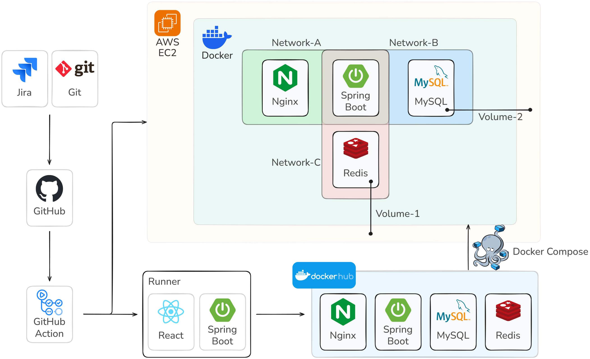
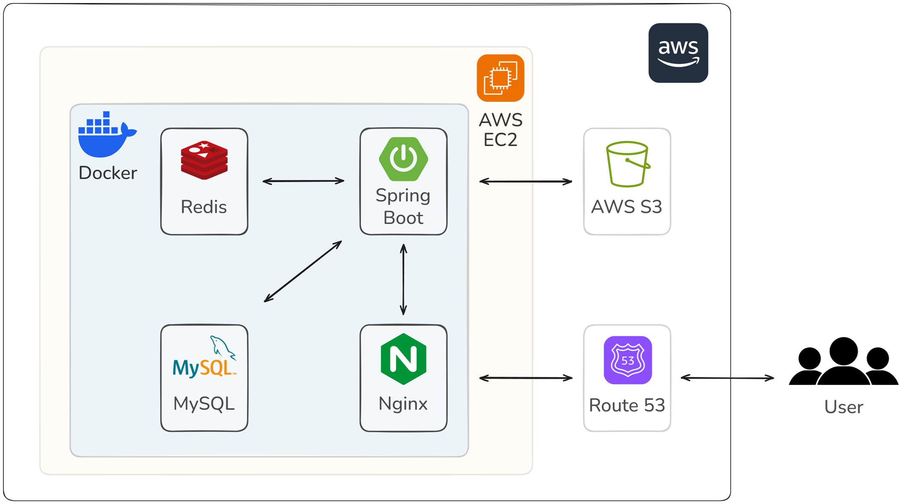

# 오수완

서울 공공 수영장의 모든 것, 오수완에서 확인하세요!

> 수영장마다 자유 수영 운영 시간이 다 다르고, 찾아보려면 여기저기 검색해야 해서 불편하지 않나요?  
> **수영헤염**은 서울 공공 수영장의 **자유 수영 운영 시간**과 이용자 리뷰를 **한눈에 볼 수 있는 서비스**입니다!

📍 지도로 한눈에 보는 수영장 정보

서울 전역 공공 수영장의 위치와 자유 수영 운영 시간을 쉽게 확인하세요!

💬 실제 이용자들의 생생한 후기

시설 상태, 수질, 혼잡도까지! 이용자 리뷰를 보고 원하는 수영장을 선택하세요.

💖 내가 찜한 수영장, 따로 모아서 보기

자주 가는 수영장을 찜하고, 운영 시간을 한눈에 확인하세요.

📝 운영 시간 업데이트 & 리뷰 작성

최신 운영 정보를 직접 제보하고, 나만의 후기를 남길 수도 있어요!

🔐 편리한 소셜 로그인

카카오, 네이버, 깃허브 로그인으로 간편하게 회원가입하고 관리하세요.

이제 수영장 정보, 여기저기 검색하지 말고 오수완에서 한 번에 확인하세요! 🏊‍♂️✨

## 소개

# 기술 스택
- 프론트엔드
- 백엔드
- 데이터베이스
- 인프라
- 버전 및 이슈 관리

# 아키텍처

## CI/CD

## 서비스 아키텍처

# 시연 영상

# 팀 소개
| [김동훈](https://github.com/hnihoon) | [서승덕](https://github.com/ssdeok) | [이재현](https://github.com/CloakingGhost) | [이태영](https://github.com/lxodud) | [차윤선](https://github.com/hisunny1007) |
| :---: | :---: | :---: | :---: | :---: |
|  |  |  |  |  |

# 참고 링크
- [GitHub Wiki](https://github.com/SesacDTeam/swim-done/wiki/%EC%B0%B8%EA%B3%A0-%EC%9E%90%EB%A3%8C)